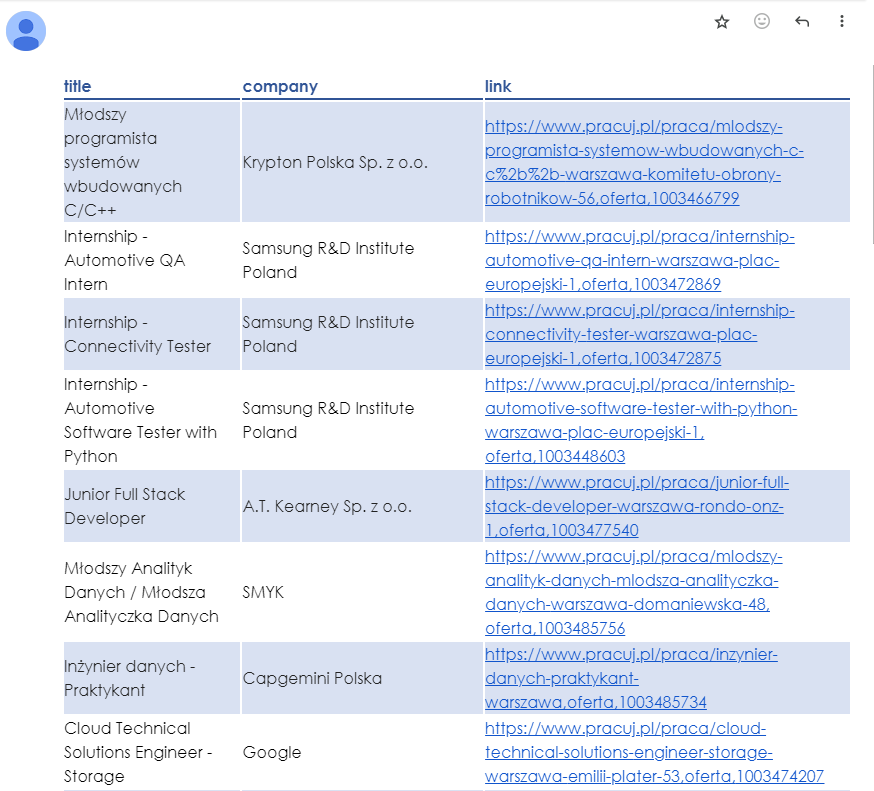

# job-scraper

## About The Project

This project is a Python-based web scraper designed to automate job searches based on specified criteria stored in a JSON file. The scraper extracts titles, companies and links from latest job listings and compiles the data into a pandas DataFrame. The project also includes functionality to generate HTML reports of the job listings and send them via email using the Gmail SMTP server.

## Built With

- Python
- BeautifulSoup
- Selenium
- pandas
- requests

## Getting Started

This section provides step-by-step instructions on how to set up the project locally.

### Installation

1. Clone the repository
   ```sh
   git clone https://github.com/fsosn/job-scraper.git
   ```
2. Create a virtual environment and install dependencies

   ```sh
   python -m venv .venv
   .venv/Scripts/activate
   pip install -r requirements.txt
   ```

3. Create .env file in the root directory and set up environmental variables
   ```sh
   FROM_EMAIL="example.email@gmail.com"
   PASSWORD="password"
   TO_EMAIL="your.email@gmail.com"
   ```
4. Run the program
   ```sh
   python main.py
   ```

## Example Job Report Email


